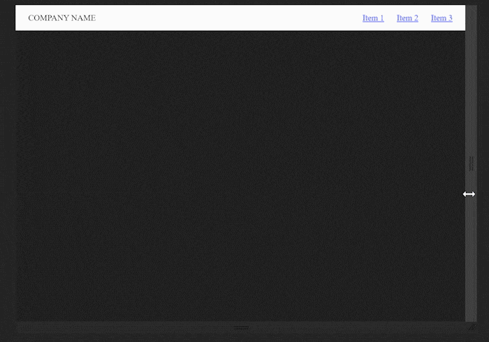

# Pure CSS Responsive Navbar

Wide screen -> display navbar items horizontally.
Small screen -> display navbar items vertically in a pull-out hamburger menu.
No JS, just a hidden checkbox and a few lines of CSS magic.

## Demo

See `demo.html` for an example of how to use this, or copy boilerplate html from `boilerplate.html`.

Instructions on how to set things up yourself are below.

## Installation

First, include the CSS file.

There are three options in the `/css` folder of this repo: a standard CSS file if you want to make changes to default values directly, a minified version if you would rather override them in a separate file, and an SCSS file if you're using SCSS, in which case you can override default variables.

For CSS, download either `sz-navbar.css` or `sz-navbar.min.css` and include it in the `<head>` of your HTML document with `<link rel="stylesheet" href="PATH-TO-FILE/sz-navbar.css" type="text/css">`.

For SASS, download `sz-navbar.scss`, put it in your SCSS directory, rename it `_sz-navbar.scss` to prevent it from being compiled, and import it into your stylesheet with `@import 'sz-navbar'`.

## Usage

See to `demo.html` for an example of how to use sz-navbar, or `boilerplate.html` for code to copy+paste into your own project (also shown below).

    
<!-- CHANGE CLASS TO "sz-navbar-right" IF DESIRED -->
        <input type="checkbox" id="sz-navbar-check">
        <label for="sz-navbar-check" class="sz-navbar-hamburger">☰</label><!-- REPLACE WITH YOUR DESIRED HAMBURGER BUTTON -->
        

            
<a href="link1">Item 1</a>
<!-- DUPLICATE AS MANY OF THESE AS DESIRED -->
        

    
